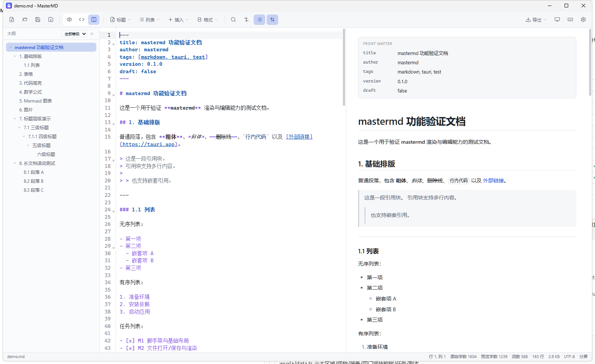
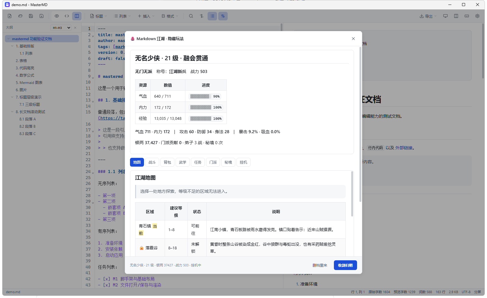

<div align="center">

# MasterMD

**为 Windows 打造的轻快 Markdown 查看与编辑器**

打开即读 · 顺手即写 · 一键导出 · 单文件带走

[](https://github.com/bigmasterpang/MasterMD/releases)
[](https://master.dapang.wang)
[](https://master.dapang.wang)
[](https://master.dapang.wang)
[](#授权与致谢)



</div>

---

## 为什么是 MasterMD

> 大多数 Markdown 工具要么太重（Electron 上百 MB），要么太简陋（只能看不能改）。
> MasterMD 用系统自带的 WebView2 渲染，把「看、写、导出、更新」四件事做到刚刚好。

| | MasterMD | 常见 Electron 编辑器 |
| --- | --- | --- |
| 安装包 | **6.1 MB（单文件便携）** | 80 – 200 MB |
| 冷启动 | **约 0.3 秒** | 2 – 5 秒 |
| 空闲内存 | **约 30 MB** | 200 – 500 MB |
| 安装方式 | 双击即用，可放 U 盘 | 必须安装 |
| 更新方式 | 应用内一键自替换 | 手动下载重装 |

## 核心特性

### 📖 阅读体验
- **GFM 全支持**：表格、任务列表、删除线、自动链接、代码块
- **扩展语法**：提示块 `> [!NOTE]`、高亮 `==文字==`、下划线 `++文字++`、上标 `x^2^`、下标 `H~2~O`
- **公式与图表**：KaTeX 数学公式、Mermaid 流程图，**按需延迟加载**（文档里没有就不加载）
- **代码高亮**：内置 18 种常用语言，其它语言检测到即按需加载
- **YAML front matter**：自动解析为顶部元数据卡片

### ✍️ 编辑体验
- **CodeMirror 6**：行号、代码折叠、多光标、括号匹配、语法高亮
- **三视图**：预览 / 源码 / 分屏，`Ctrl+E` 一键循环，分屏滚动自动同步
- **富文本快捷编辑**：标题、列表、任务、引用、提示块、表格、公式、图表、目录……一个右键菜单全搞定
- **查找替换**：正则、全字匹配、区分大小写、循环查找、全部替换，实时计数
- **多标签页 + 会话恢复**：意外关闭也不丢内容

### 📤 导出能力
| 格式 | 特点 |
| --- | --- |
| **HTML** | 单文件自包含，内联样式与图片，随手分享 |
| **PNG** | 2 倍高清渲染，公式、图表、代码高亮完整保留 |
| **Word (.docx)** | 标题/列表/表格/代码块/图片，浏览器内生成 OOXML |
| **PDF** | 直连 WebView2 打印引擎，无需额外打印驱动 |

### 🔄 更新与分发
- **应用内一键更新**：下载 → SHA-256 校验 → 自动替换程序 → 自动重启
- **双节点容灾**：软件中心主站 + 国内加速节点自动切换
- **离线也能看**：单文件便携版无需安装，放到任意目录即可运行

### 🥚 藏了一个游戏
连续点击「关于」面板左上角图标 **7 次**，会解锁隐藏文字冒险 **「Markdown 地牢」**；
工具栏的**「江湖」**按钮里，还藏着一部完整的文字武侠 —— 地图、装备、门派、任务、副本、挂机全都有，
而且所有内容都用 Markdown 语法演出（表格是属性面板、引用块是剧情、代码块是战斗记录）。



## 下载与使用

**方式一：软件中心下载（推荐，含国内加速）**

👉 <https://master.dapang.wang>

**方式二：GitHub Releases**

| 文件 | 说明 |
| --- | --- |
| `MasterMD_x.y.z_x64.exe` | **便携版**：双击即用，无需安装，可放任意目录 / U 盘 |
| `MasterMD_x.y.z_x64-setup.exe` | **安装版**：注册开始菜单与 `.md` 文件关联 |

> 需要 WebView2 运行时：Windows 11 自带；Windows 10 会在安装时自动引导安装（或手动装一次微软官方运行时即可）。

**上手三步**：拖入 `.md` 文件 → `Ctrl+E` 选视图 → `Ctrl+S` 保存。

## 快捷键速查

| 操作 | 快捷键 | | 操作 | 快捷键 |
| --- | --- | --- | --- | --- |
| 打开文件 | `Ctrl+O` | | 加粗 / 斜体 | `Ctrl+B` / `Ctrl+I` |
| 保存 / 另存为 | `Ctrl+S` / `Ctrl+Shift+S` | | 高亮 / 下划线 | `Ctrl+Shift+M` / `Alt+Shift+U` |
| 切换视图 | `Ctrl+E` | | 标题 H1–H6 | `Ctrl+1` … `Ctrl+6` |
| 查找 / 替换 | `Ctrl+F` / `Ctrl+H` | | 无序 / 有序 / 任务列表 | `Ctrl+Shift+8` / `7` / `9` |
| 下一个 / 上一个匹配 | `F3` / `Shift+F3` | | 提示块 / 代码块 / 表格 | `Ctrl+Shift+L` / `C` / `T` |
| 关闭标签 / 切换标签 | `Ctrl+W` / `Ctrl+Tab` | | 快捷键面板 | `F1` |

## 技术栈

<div align="center">

**Tauri 2** · **Rust** · **React 19** · **TypeScript** · **Vite** · **TailwindCSS 4** · **CodeMirror 6** · **markdown-it** · **highlight.js** · **DOMPurify**

</div>

- 前后端分离：文件读写、文件监听、自然语言下载与打印走 Rust；界面与渲染走 WebView2
- 体积优先：KaTeX / Mermaid / 代码语言包全部走 Vite 代码分割按需加载
- 安全优先：`html: false` + DOMPurify 双重清理，外链交给系统浏览器打开

## 开发与构建

```bash
# 环境：Node ≥ 20、pnpm ≥ 9、Rust stable ≥ 1.77、VS Build Tools 2022
pnpm install
pnpm tauri dev        # 开发运行
pnpm typecheck        # 类型检查（提交前必过）
pnpm build            # 仅构建前端
pnpm tauri build      # 打包便携版 + NSIS 安装包
```

国内网络可先设置代理：

```powershell
$env:HTTP_PROXY="http://127.0.0.1:7890"; $env:HTTPS_PROXY="http://127.0.0.1:7890"
```

发布到软件中心（双节点自动分发）：

```powershell
.\tools\publish.ps1 -Build              # 编译并发布便携版
.\tools\publish.ps1 -Mode installer     # 发布安装包
```

## 项目结构

```text
src/
├── components/    工具栏 / 编辑器 / 预览 / 大纲 / 搜索 / 设置 / 弹窗
├── hooks/         渲染管线、滚动同步、文件监听、主题、自动保存、快捷键
├── stores/        Zustand：文档、设置、搜索、弹窗、更新
├── utils/         markdown 渲染、front matter、清理、导出、持久化
├── wuxia/         隐藏玩法「Markdown 江湖」（数据 / 引擎 / 存档 / 界面）
└── easter-egg/    隐藏小游戏「Markdown 地牢」

src-tauri/src/
├── lib.rs         插件注册、窗口关闭拦截、启动参数
└── commands/      文件、最近文件、图片、文件监听、PDF 打印、在线更新
```

## 已知问题

- 导出的 HTML / DOCX 不内联远程图片；HTML 中 KaTeX 公式样式不内联
- 大于 1 MB 的文档默认关闭实时预览，导出与打印前需先点「渲染预览」
- 应用内更新面向便携版设计：会替换当前程序并重启
- 暂未实现单实例运行，连续双击多个文件会打开多个窗口

## 授权与致谢

- 作者：**Master Wang（王大师）** · Master 系列软件
- 问题反馈：<https://github.com/bigmasterpang/MasterMD/issues>
- 软件中心：<https://master.dapang.wang>

<div align="center">

**如果 MasterMD 让你少装了一个几百 MB 的编辑器，欢迎点个 ⭐ Star**

</div>
