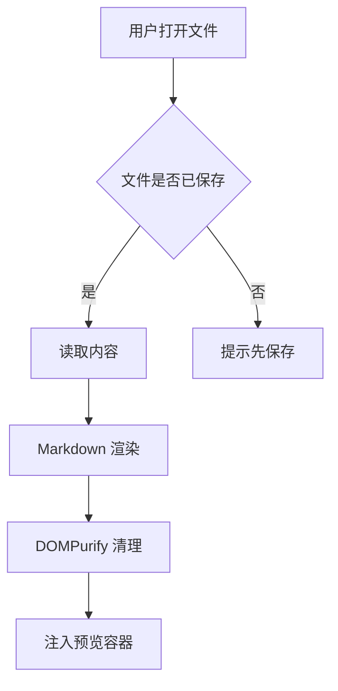

# mastermd 功能验证文档

这是一个用于验证 **mastermd** 渲染与编辑能力的测试文档。

## 1. 基础排版

普通段落，包含 **粗体**、*斜体*、~~删除线~~、`行内代码` 以及 [外部链接](https://tauri.app)。

> 这是一段引用块。
> 引用块支持多行内容。
>
> > 也支持嵌套引用。

---

### 1.1 列表

无序列表：

- 第一项
- 第二项
  - 嵌套项 A
  - 嵌套项 B
- 第三项

有序列表：

1. 准备环境
2. 安装依赖
3. 启动应用

任务列表：

- [x] M1 脚手架与基础布局
- [x] M2 文件打开/保存与渲染
- [x] M3 CodeMirror 6 编辑器与分屏
- [ ] M4 搜索、最近文件、主题、大纲
- [ ] M5 YAML、图片粘贴、导出 HTML

## 2. 表格

| 功能 | 状态 | 说明 |
| --- | :---: | --- |
| 打开文件 | ✅ | Ctrl+O |
| 保存 | ✅ | Ctrl+S |
| 分屏预览 | ✅ | 滚动同步 |
| 导出 HTML | 🚧 | 内联 CSS 与图片 |

## 3. 代码高亮

```typescript
interface DocState {
  filePath: string | null;
  content: string;
  isDirty: boolean;
}

export function isDirty(doc: DocState): boolean {
  return doc.content !== doc.savedContent;
}
```

```rust
#[tauri::command]
async fn write_markdown_file(path: String, content: String) -> Result<u64, String> {
    std::fs::write(&path, content.as_bytes()).map_err(|e| e.to_string())?;
    Ok(0)
}
```

```python
def fib(n: int) -> int:
    """计算斐波那契数列"""
    a, b = 0, 1
    for _ in range(n):
        a, b = b, a + b
    return a
```

```bash
pnpm install
pnpm tauri dev
```

```json
{ "name": "mastermd", "version": "0.1.0", "private": true }
```

```sql
SELECT id, title, created_at FROM documents WHERE draft = 0 ORDER BY created_at DESC;
```

```yaml
theme: dark
fontSize: 14
shortcuts:
  save: Ctrl+S
```

## 4. 数学公式

行内公式：质能方程 $E = mc^2$，以及 $\alpha + \beta = \gamma$。

块级公式：

$$
\int_{-\infty}^{\infty} e^{-x^2} \, dx = \sqrt{\pi}
$$

## 5. Mermaid 图表



## 6. 图片

相对路径图片（验证解析与占位提示）：


外部图片：


## 7. 标题层级演示

### 7.1 三级标题

#### 7.1.1 四级标题

##### 五级标题

###### 六级标题

## 8. 长文档滚动测试

### 8.1 段落 A

正文内容 A。用于测试滚动同步与大纲跳转。

### 8.2 段落 B

正文内容 B。

### 8.3 段落 C

正文内容 C。
