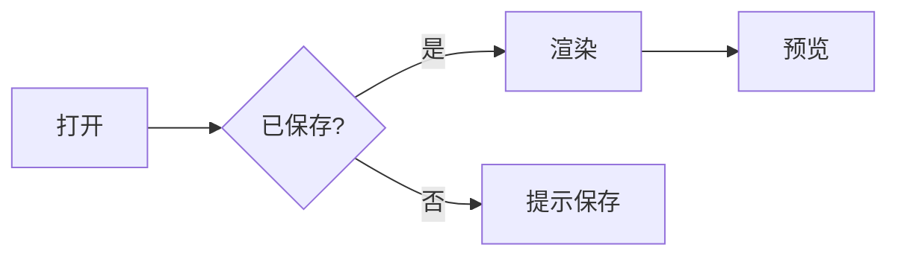

# 全功能验证

| 功能 | 状态 | 快捷键 |
| --- | :---: | --- |
| 打开 | ✅ | Ctrl+O |
| 保存 | ✅ | Ctrl+S |

- [x] 任务列表已完成项
- [ ] 任务列表未完成项

行内公式 $E = mc^2$ 与 $\frac{a}{b}$，块级公式：

$$
\sum_{i=1}^{n} i = \frac{n(n+1)}{2}
$$



```rust
fn main() {
    let msg = "Hello, mastermd";
    println!("{}", msg);
}
```

```typescript
const add = (a: number, b: number): number => a + b;
```

> 引用块样式验证。

普通段落 **粗体** *斜体* ~~删除线~~ `代码` [链接](https://tauri.app)。
