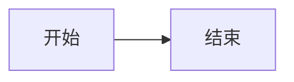

# 列表与插入验证

## 1. 有序列表

1. 第一项
2. 第二项
3. 第三项

## 2. 无序列表

- 你好
- 世界
  - 嵌套 A
  - 嵌套 B

## 3. 任务列表（点击可勾选）

- [ ] 待办事项一
- [x] 已完成事项二

## 4. 链接与公式

[Markdown 指南](https://example.com)

行内公式 $E = mc^2$，块级公式：

$$
\sum_{i=1}^{n} i = \frac{n(n+1)}{2}
$$

